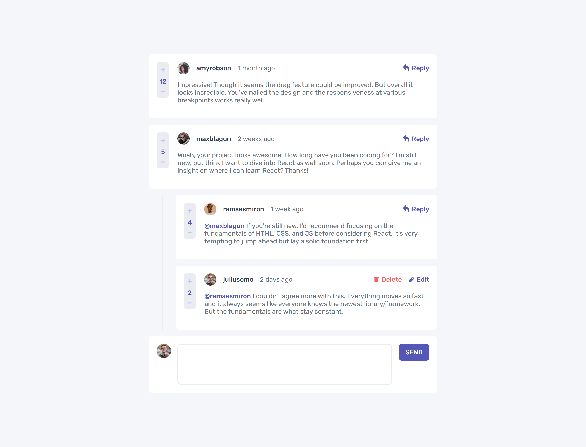
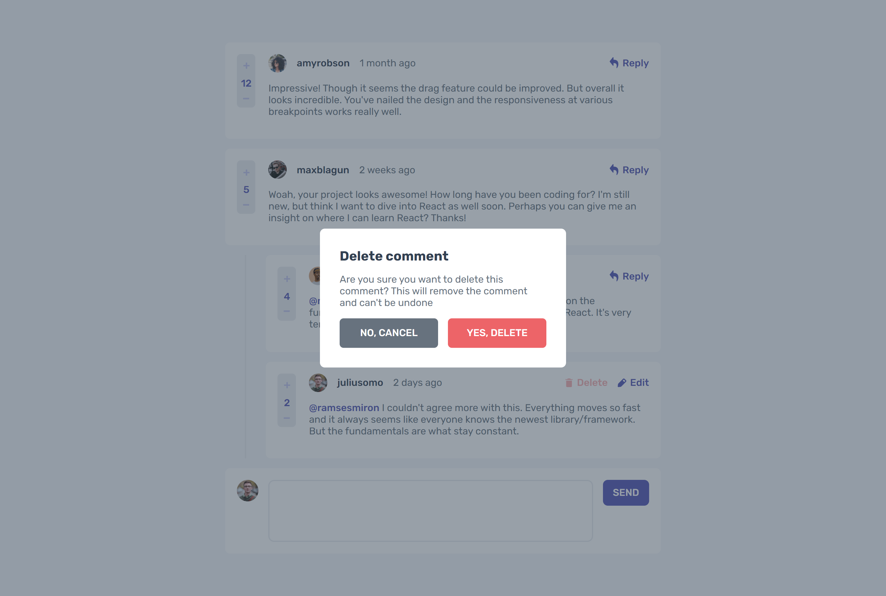
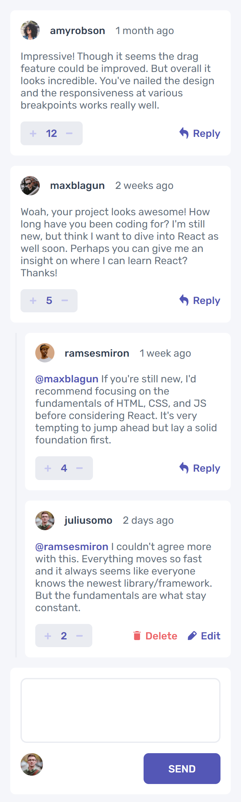
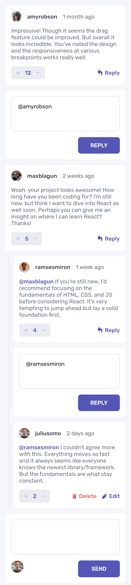
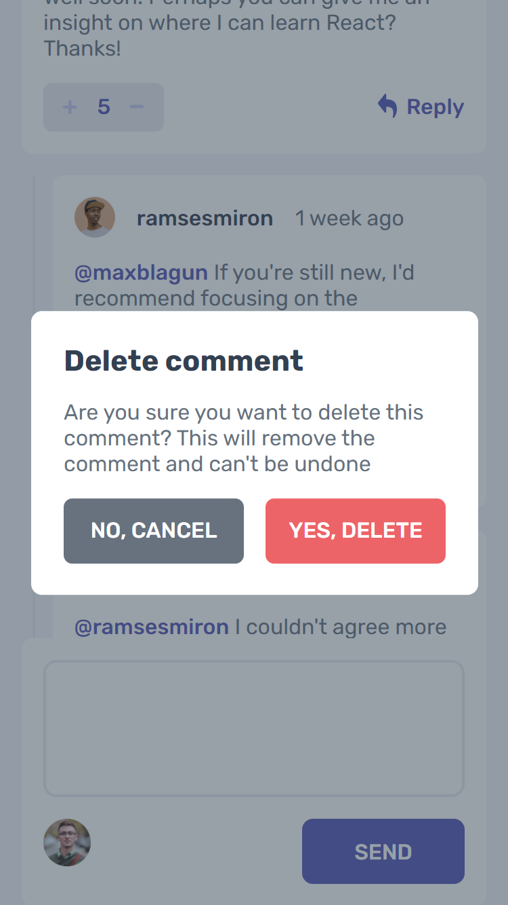

# Interactive Comments Section

## Table of contents

- [Overview](#overview)
   - [Built with](#built-with)
   - [Features](#features)
   - [Screenshots](#screenshots)
- [Todo](#todo)
- [Links](#links)

## Overview

### Built with:

* TypeScript
* React
* Redux/React-redux
* Redux Toolkit
* Vite (bundler)
* CSS Modules

### Features:

* Edit your replies and/or comments
* Reply to a comment or another reply
* Delete your comments
* Comments/replies are stored in local storage

## Screenshots

### Desktop

### Mobile

***

## Todo:

1. Sort comments and replies by amount of upvotes.
2. Dinamically set the time that a comment or reply was posted based on user's current date/time.

## Links
* [Frontend Mentor](https://www.frontendmentor.io/home)
* [My Frontend Mentor Profile](https://www.frontendmentor.io/profile/htcsjs)
* [My Codewars Profile](https://www.codewars.com/users/JonathanP4)

